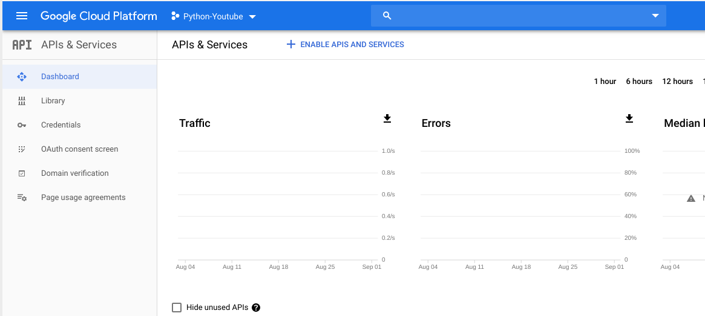

This doc is a simple tutorial to show how to use this library to get data from YouTube DATA API.

You can get the whole description for YouTube API at [YouTube API Reference](https://developers.google.com/youtube/v3/docs/).

## Prerequisite

At the beginning. You need to create a [Google Project](https://console.cloud.google.com) by your google account.

Every new account has 12 project to cost.

## Create your project

Click the `Select a project-> NEW PROJECT` to create a new project to use our library.

Fill the basic info to finish created.


## Enable YouTube DATA API service

Once the project created, the browser will redirect project home page.

Then click the `≡≡` symbol on the left top. Chose the `APIs & Services` tab.

You will see follow info.



Click the `+ ENABLE APIS AND SERVICES` symbol. And input `YouTube DATA API` to search.


Then chose the ``YouTube DATA API`` item.


Then click the `ENABLE` blue button. Now the service has been activated.

## Create credentials

To use this API, you may need credentials. Click 'Create credentials' to get started.


You need to fill in some information to create credentials.

Just chose `YouTube DATA API v3`, `Other non-UI (e.g. cron job, daemon)` and `Public data`.

Then click the blue button `What credentials do I need?` to create.


Now you have generated one api key.

Use this key. You can retrieve public data for YouTube data by our library

```python
from pyyoutube import Client

cli = Client(api_key="your api key")
```

If you want to get some examples to see, check out the [examples](https://github.com/sns-sdks/python-youtube/tree/master/examples).

If you have an opens source application using python-youtube, send me a link, and I am very happy to add a link to it here.

But if you want to get user data by OAuth. You need create the credential for ``OAuth client ID``.

And get more info at next page for [Authorization](authorization.md).
