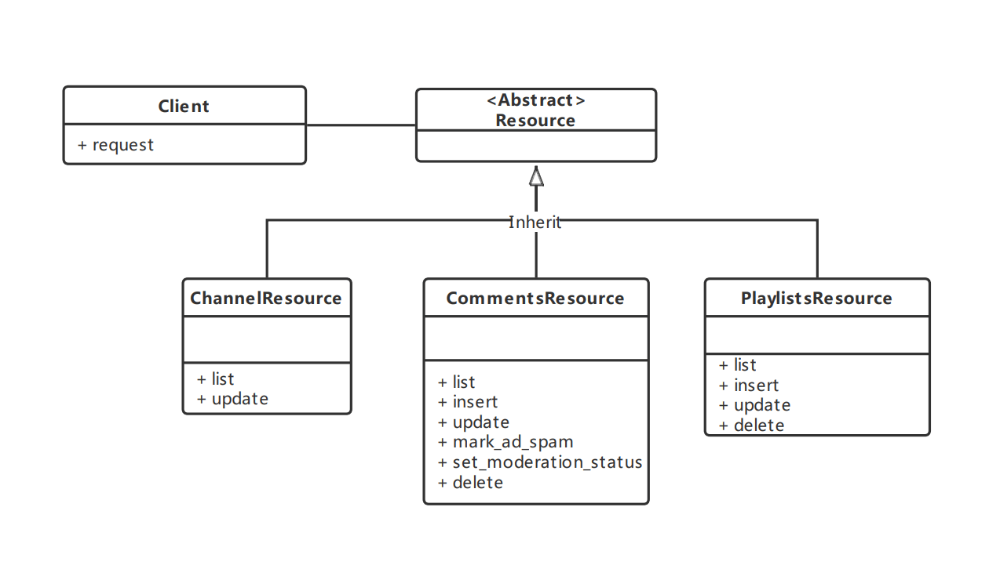

# Work with Client

We have refactored the project code to support more methods and improve code usability.

And new structure like follows.



In this structure, we identify each entity as a class of resources and perform operations on the resources.

## INSTANTIATE

Client is exposed via the ``pyyoutube.Client`` class.

You can initialize it with `api key`, to get public data.

```python
from pyyoutube import Client

cli = Client(api_key="your api key")
```

If you want to update your channel data. or upload video. You need initialize with `access token`, Or do auth flow.

```python
from pyyoutube import Client

cli = Client(access_token="Access Token with permissions")
```

```python
from pyyoutube import Client

cli = Client(client_id="ID for app", client_secret="Secret for app")
# Get authorization url
cli.get_authorize_url()
# ('https://accounts.google.com/o/oauth2/v2/auth?response_type=code&client_id=id&redirect_uri=https%3A%2F%2Flocalhost%2F&scope=scope&state=PyYouTube&access_type=offline&prompt=select_account', 'PyYouTube')
# Click url and give permissions.
# Copy the redirected url.
cli.generate_access_token(authorization_response="redirected url")
# AccessToken(access_token='token', expires_in=3599, token_type='Bearer')
```

### from client_secret

Only `web` and some `installed` type client_secrets are supported.

The fields `client_id` and `client_secret` must be set.

If the field `redirect_uris` has 1 or more values set, the `Client.DEFAULT_REDIRECT_URI` will be set to the first entrie.

```python
from pyyoutube import Client

file_path = "path/to/client_secret.json"
cli = Client(client_secret_path=file_path)

# Then go through auth flow descriped above
```

Once initialize client. Then you can operate API to get data.

## Usage

### Channel Resource

The API supports the following methods for `channels` resources:

- list: Returns a collection of zero or more channel resources that match the request criteria.
- update: Updates a channel's metadata. Note that this method currently only supports updates to the channel resource's
  brandingSettings and invideoPromotion objects and their child properties

#### List channel data

```python
resp = cli.channels.list(channel_id="UC_x5XG1OV2P6uZZ5FSM9Ttw")
# ChannelListResponse(kind='youtube#channelListResponse')
print(resp.items)
# [Channel(kind='youtube#channel', id='UC_x5XG1OV2P6uZZ5FSM9Ttw')]
```

#### update channel metadata

```python
import pyyoutube.models as mds

body = mds.Channel(
    id="channel id",
    brandingSettings=mds.ChannelBrandingSetting(
        image=mds.ChannelBrandingSettingImage(
            bannerExternalUrl="new banner url"
        )
    )
)

channel = cli.channels.update(
    part="brandingSettings",
    body=body
)
print(channel.brandingSettings.image.bannerExternalUrl)
# 'https://yt3.googleusercontent.com/AegVxoIusdXEmsJ9j3bcJR3zuImOd6TngNw58iJAP0AOAXCnb1xHPcuEDOQC8J85SCZvt5i8A_g'
```

### Video Resource

The API supports the following methods for `videos` resources.

#### getRating

Retrieves the ratings that the authorized user gave to a list of specified videos.

```python
resp = cli.videos.get_rating(video_id="Z56Jmr9Z34Q")

print(resp.items)
# [VideoRatingItem(videoId='Z56Jmr9Z34Q', rating='none')]
```

#### list

Returns a list of videos that match the API request parameters.

```python
resp = cli.videos.list(video_id="Z56Jmr9Z34Q")

print(resp.items)
# [Video(kind='youtube#video', id='Z56Jmr9Z34Q')]
```

#### insert

Uploads a video to YouTube and optionally sets the video's metadata.

```python
import pyyoutube.models as mds
from pyyoutube.media import Media

body = mds.Video(
    snippet=mds.VideoSnippet(
        title="video title",
        description="video description"
    )
)

media = Media(filename="video.mp4")

upload = cli.videos.insert(
    body=body,
    media=media,
    parts=["snippet"],
    notify_subscribers=True
)

video_body = None

while video_body is None:
    status, video_body = upload.next_chunk()
    if status:
        print(f"Upload progress: {status.progress()}")

print(video_body)
# {"kind": "youtube#video", "etag": "17W46NjVxoxtaoh1E6GmbQ2hv5c",....}
```

#### update

Updates a video's metadata.

```python
import pyyoutube.models as mds

body = mds.Video(
    id="fTK1Jj6QlDw",
    snippet=mds.VideoSnippet(
        title="What a nice day",
        description="Blue sky with cloud. updated.",
        categoryId="1",
    )
)

resp = cli.videos.update(
    parts=["snippet"],
    body=body,
    return_json=True,
)
print(resp)
# {"kind": "youtube#video", "etag": "BQUtovVd0TBJwC5S8-Pu-dK_I6s", "id": "fTK1Jj6QlDw", "snippet": {"publishedAt": "2022-12-15T03:45:16Z", "channelId": "UCa-vrCLQHviTOVnEKDOdetQ", "title": "What a nice day", "description": "Blue sky with cloud. updated.", "thumbnails": {"default": {"url": "https://i.ytimg.com/vi/fTK1Jj6QlDw/default.jpg", "width": 120, "height": 90}, "medium": {"url": "https://i.ytimg.com/vi/fTK1Jj6QlDw/mqdefault.jpg", "width": 320, "height": 180}, "high": {"url": "https://i.ytimg.com/vi/fTK1Jj6QlDw/hqdefault.jpg", "width": 480, "height": 360}, "standard": {"url": "https://i.ytimg.com/vi/fTK1Jj6QlDw/sddefault.jpg", "width": 640, "height": 480}, "maxres": {"url": "https://i.ytimg.com/vi/fTK1Jj6QlDw/maxresdefault.jpg", "width": 1280, "height": 720}}, "channelTitle": "ikaros data", "categoryId": "1", "liveBroadcastContent": "none", "localized": {"title": "What a nice day", "description": "Blue sky with cloud. updated."}, "defaultAudioLanguage": "en-US"}}
```

#### delete

Deletes a YouTube video.

```python
cli.videos.delete(video_id="fTK1Jj6QlDw")
# True
```

#### rate

Add a like or dislike rating to a video or remove a rating from a video.

```python
cli.videos.rate(video_id="fTK1Jj6QlDw", rating="like")
# True
```

#### reportAbuse

Report a video for containing abusive content.

```python
import pyyoutube.models as mds

body = mds.VideoReportAbuse(
    videoId="fTK1Jj6QlDw",
    reasonId="32"
)
cli.videos.report_abuse(body=body)
# True
```
