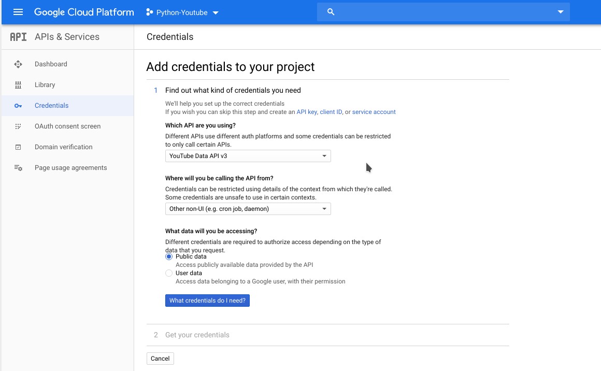

Getting Started
===============

This doc is a simple tutorial to show how to use this library to get data from YouTube DATA API.

You can get the whole description for YouTube API at `YouTube API Reference <https://google-developers.appspot.com/youtube/v3/docs/>`_.

Prerequisite
------------

At the beginning. You need to create a `Google Project <https://console.cloud.google.com>`_ by your google account.
Every new account has 12 project to cost.

Create your project
-------------------

Click the ``Select a project-> NEW PROJECT`` to create a new project to use our library.
Fill the basic info to finish created.

.. image:: images/gt-create-app-1.png

Enable YouTube DATA API service
-------------------------------

Once the project created, the browser will redirect project home page.

Then click the ``≡≡`` symbol on the left top. Chose the ``APIs & Services`` tab.

You will see follow info.

.. image:: images/gt-create-app-2.png

Click the ``+ ENABLE APIS AND SERVICES`` symbol. And input ``YouTube DATA API`` to search.

.. image:: images/gt-create-app-3.png

Then chose the ``YouTube DATA API`` item.

.. image:: images/gt-create-app-4.png

Then click the ``ENABLE`` blue button. Now the service has been activated.

Create credentials
------------------

To use this API, you may need credentials. Click 'Create credentials' to get started.

You need to fill in some information to create credentials.

Just chose ``YouTube DATA API v3``, ``Other non-UI (e.g. cron job, daemon)`` and ``Public data``.

Then click the blue button ``What credentials do I need?`` to create.

.. image:: images/gt-create-app-6.png

Now you has generated one api key.

Use this key. You can retrieve public data for YouTube data by our library::

    In [1]: import pyyoutube
    In [2]: api = pyyoutube.Api(api_key='your api key')

But if you want to get user data by OAuth. You need create the credential for ``OAuth client ID``.

And get more info at next page.
